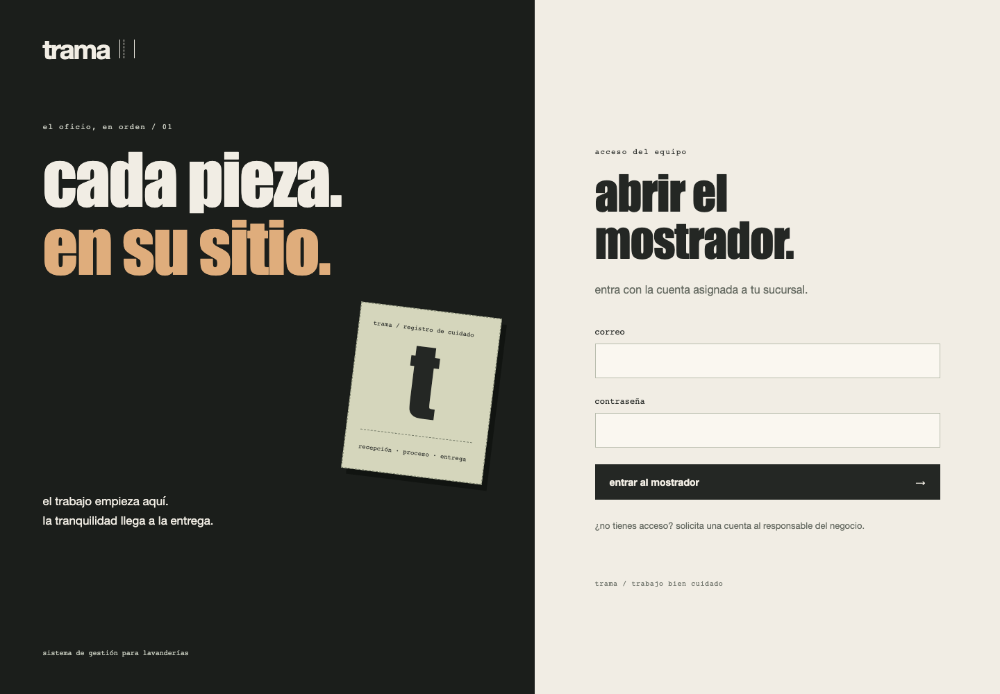
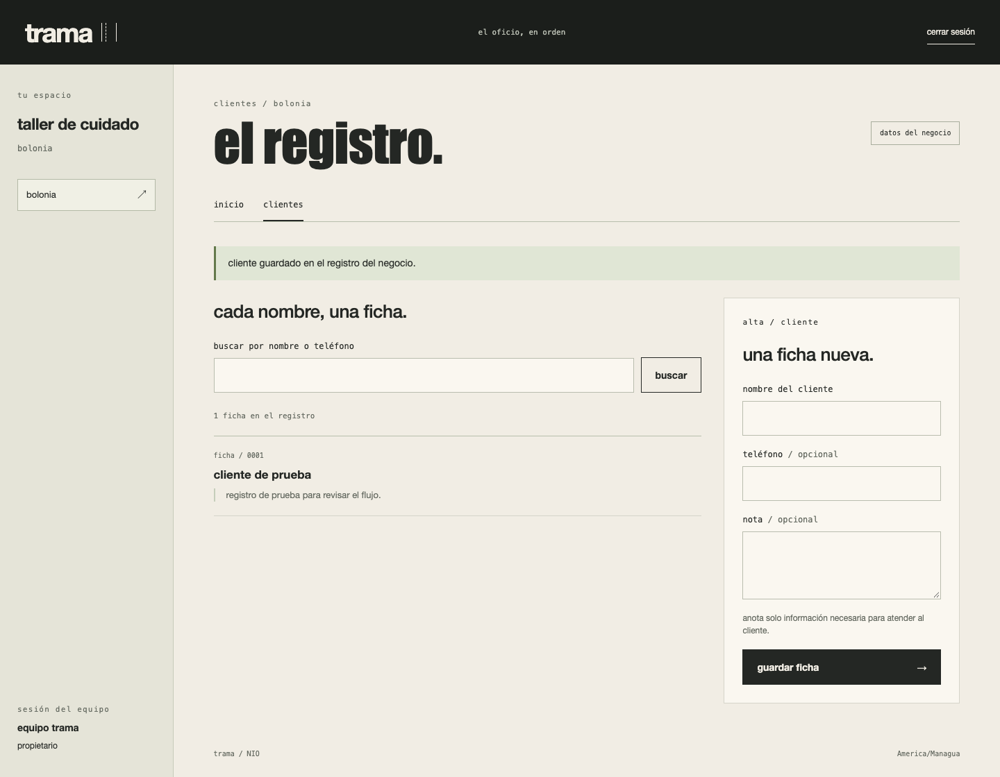

# trama

propuesta de un sistema para lavanderías: identificar cada pieza o bulto, conservar instrucciones y verificar qué se entrega a cada cliente.

**estado:** demo interactiva y backend laravel 13 con acceso por negocio, sucursal y rol, más registro y búsqueda de clientes y catálogo de servicios. todavía no recibe órdenes; los datos de las capturas son de prueba.

[ver la demo y el avance del backend](https://kisnner26.github.io/trama-lavanderia/) · [alcance inicial](docs/producto.md) · [flujo operativo](docs/operacion.md) · [modelo de datos](docs/datos.md) · [arquitectura](docs/arquitectura.md) · [plan](docs/plan.md)


## primera versión propuesta

- recepción con cliente, servicio, unidades e instrucciones especiales.
- identificación mediante etiquetas y búsqueda por código.
- seguimiento individual de prendas y bultos, con historial e incidencias.
- cobros y saldo separados del proceso de lavado.
- entrega verificada, completa o parcial.

la demo usa dos prendas ficticias y permite recorrer sus estados; al recargar se reinicia. no genera etiquetas qr ni realiza cobros.

## probar la propuesta

sin instalar dependencias, con python 3 para servir la demo y node.js para las pruebas:

```sh
python3 -m http.server 8080 --directory site
# abrir http://localhost:8080
npm test
```

## desarrollo

el backend vive en `backend/` y requiere php 8.3–8.5, composer y mysql. la demo de github pages es independiente: pages no ejecuta php.

```sh
cd backend
composer run setup
# configurar una base vacía y sus credenciales en .env
php artisan migrate
php artisan trama:provision responsable@example.test --business="mi lavandería" --branch="central" --name="responsable"
# la contraseña se solicita de forma oculta; no hay una cuenta predeterminada
php artisan serve
```

`composer test` verifica el backend. `/up` comprueba que el proceso responde; no certifica la disponibilidad de la base de datos. `.env`, dependencias y bases locales no se publican.

las capturas provienen de la demo ejecutada en un navegador, en escritorio y móvil. [captura móvil](docs/img/mobile.png).

## acceso del equipo

la cuenta inicial se crea con `trama:provision`. cada empleado necesita una asignación explícita a su sucursal; conocer otro identificador no concede acceso. el formulario protege la sesión con csrf y limita intentos fallidos. el alta pública, la gestión visual del equipo y la recuperación de contraseñas siguen pendientes.





el tarifario permite cobro por pieza o kilogramo y configurar si el servicio incluye acabado. solo el propietario añade servicios; recepción puede consultarlos. los precios se guardan como centavos enteros en la moneda del negocio (nio o usd). la recepción de órdenes y los cobros todavía están pendientes.

[captura del tarifario](docs/img/backend-services.png) · [captura del backend en móvil](docs/img/backend-mobile.png). el backend se ejecuta localmente; github pages muestra la demo y capturas del avance.
