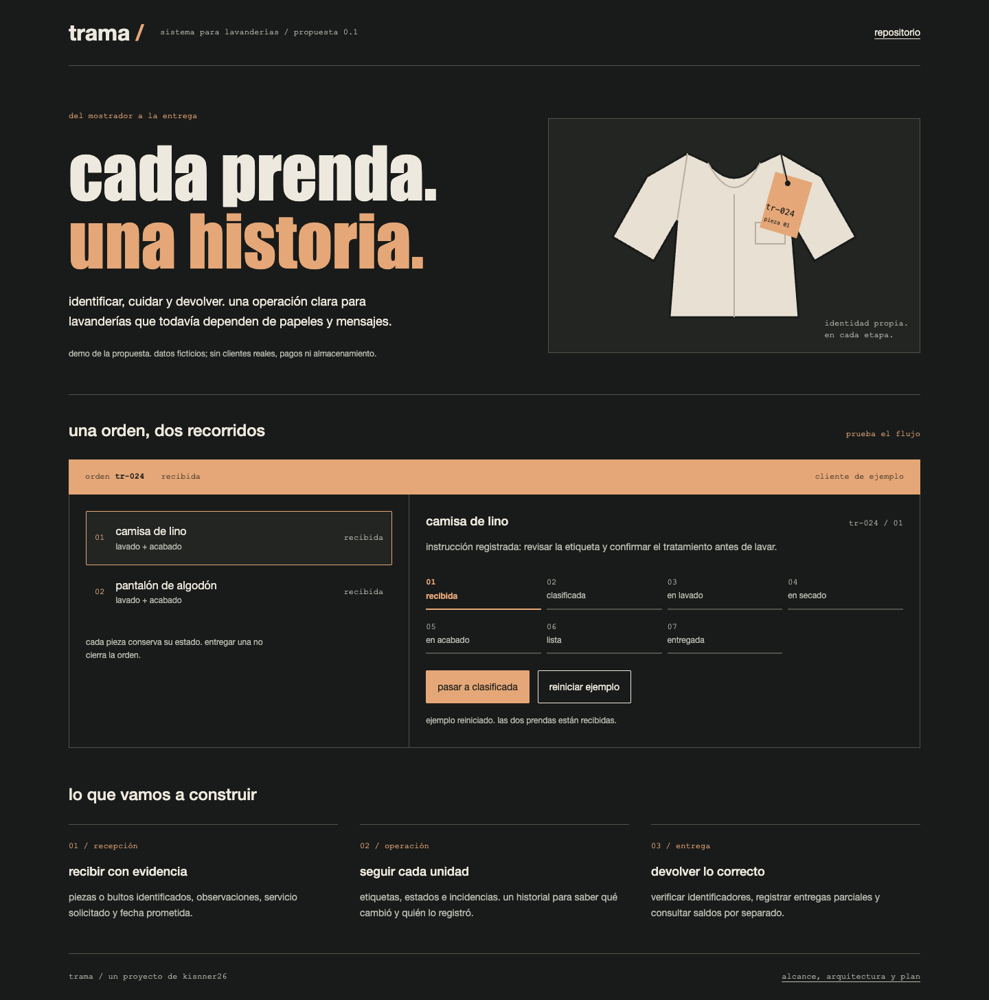

# trama

propuesta de un sistema para lavanderías: identificar cada pieza o bulto, conservar instrucciones y verificar qué se entrega a cada cliente.

**estado:** documentación y demo interactiva. todavía no existe un backend operativo, base de datos ni registro de clientes reales.

[ver la demo](https://kisnner26.github.io/trama-lavanderia/) · [alcance inicial](docs/producto.md) · [flujo operativo](docs/operacion.md) · [modelo de datos](docs/datos.md) · [arquitectura](docs/arquitectura.md) · [plan](docs/plan.md)



## primera versión propuesta

- recepción con cliente, servicio, unidades e instrucciones especiales.
- identificación mediante etiquetas y búsqueda por código.
- seguimiento individual de prendas y bultos, con historial e incidencias.
- cobros y saldo separados del proceso de lavado.
- entrega verificada, completa o parcial.

la demo usa dos prendas ficticias y permite recorrer sus estados; al recargar se reinicia. no genera etiquetas qr ni realiza cobros.

## probar la propuesta

sin instalar dependencias, con python 3 para servir la demo y node.js para las pruebas:

```sh
python3 -m http.server 8080 --directory site
# abrir http://localhost:8080
npm test
```

## desarrollo

el sistema operativo se plantea con laravel, mysql y una interfaz web adaptable. estas decisiones y sus criterios de aceptación están en la documentación; este repositorio todavía no contiene una aplicación laravel.

las capturas provienen de la demo ejecutada en un navegador, en escritorio y móvil. [captura móvil](docs/img/mobile.png).
