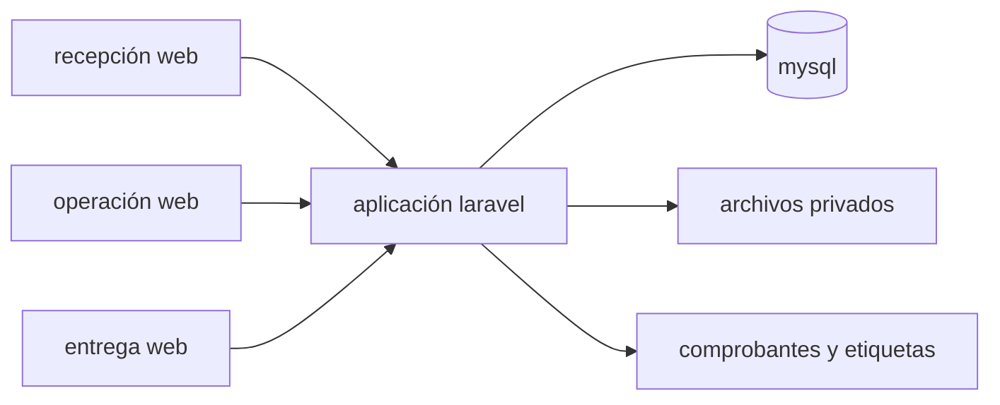

# arquitectura propuesta

## implementación inicial

monolito laravel con mysql y una interfaz web adaptable. usar las mismas reglas de dominio desde recepción, operación y entrega; no repartir el piloto en microservicios. las versiones concretas se elegirán al iniciar el backend y se fijarán en sus archivos de dependencias.

la demo actual es html, css y javascript sin dependencias; sus estados ilustran el producto, pero no validan permisos, pagos, impresoras ni transacciones.

## módulos

| módulo | responsabilidad |
|---|---|
| acceso | sesiones, roles, pertenencia al negocio y permisos por sucursal |
| catálogo | servicios, unidades de cobro y rutas de trabajo |
| recepción | cliente, orden, condiciones copiadas e identificación |
| operación | transiciones permitidas, historial e incidencias |
| cobros | pagos manuales, reversión autorizada y saldo |
| entrega | validación de unidades, autorización y comprobante |
| reportes | pendientes, vencidas, listas y entregas parciales |

## roles propuestos

- propietario: catálogo, usuarios, reportes, configuración y autorizaciones.
- recepción: clientes, órdenes, anticipos, búsqueda y entregas permitidas.
- operador: consultar instrucciones y registrar estados e incidencias en su sucursal.

no aceptar `business_id` enviado por el navegador como autorización. el contexto se resuelve desde la sesión y las membresías; las políticas y consultas aplican el mismo contexto. no habrá usuario público de administración ni registro de clientes en la demo.

## operaciones críticas

confirmar recepción crea orden, líneas, unidades y evento inicial en una transacción. generar un código correlativo requiere un contador bloqueado por negocio/sucursal, no `max(código) + 1`.

avanzar una unidad comprueba ruta, versión actual e incidencias. una actualización obsoleta devuelve conflicto para que el operador recargue; no pisa cambios de otro empleado.

confirmar entrega bloquea las unidades, valida pertenencia y disponibilidad, registra entrega y actualiza el historial en una transacción. el saldo y la autorización para entregar con deuda se comprueban dentro de esa operación. pagos simultáneos y entregas deben bloquear primero la orden y luego unidades en orden estable para evitar lecturas inconsistentes.

## etiquetas y privacidad

la etiqueta contiene identificador legible y qr del código, no nombre ni teléfono. escanearla dentro de la aplicación autenticada busca la unidad. la impresión debe poder repetirse sin crear otra unidad; confirmar formato y tamaño con el dispositivo real del piloto.

fotos en almacenamiento privado, límites de tamaño y tipo, acceso autorizado y descargas temporales. no conservar contraseñas, información de pago ni datos del cliente en logs. acordar conservación de fotos y órdenes con el negocio antes de cargar información real.

si se añade consulta pública, usar un token aleatorio, revocable, con caducidad y limitado a datos mínimos de una orden. el código correlativo no habilita esa consulta.

## operación y recuperación

copias de mysql y archivos privados, procedimiento de restauración probado, reloj consistente y monitoreo de errores. no prometer funcionamiento sin conexión: el piloto requiere conexión al servidor. confirmar si se alojará en la nube o dentro del local antes de desplegarlo.
