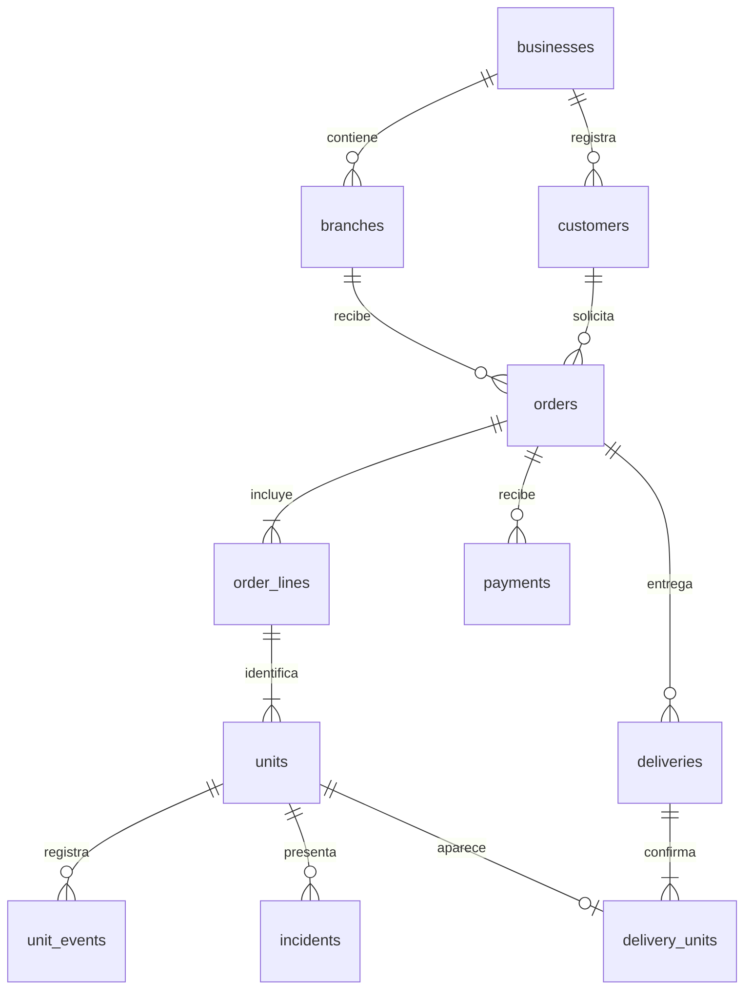

# modelo de datos propuesto

especificación lógica, todavía sin migraciones. todas las entidades operativas pertenecen a un `business_id`; las relaciones deben impedir referencias a otro negocio, además de filtrar consultas.

## entidades

| entidad | campos principales | restricción clave |
|---|---|---|
| businesses | nombre, moneda, zona horaria | configuración por negocio |
| branches | business_id, nombre, dirección | sucursal del negocio |
| users / memberships | usuario, negocio, rol, sucursales permitidas | acceso autorizado, no rol global |
| customers | business_id, nombre, teléfono opcional | sin unicidad global del teléfono |
| services | business_id, nombre, unidad de cobro, precio, ruta | catálogo editable y archivable |
| orders | business_id, branch_id, customer_id, código, promised_at, moneda, versión | código único dentro del negocio |
| order_lines | business_id, order_id, descripción, cantidad, precio, total, ruta copiada | condiciones acordadas, no precio vivo |
| units | business_id, order_id, order_line_id, código, tipo, estado, instrucciones, versión | código único por negocio; tipo pieza o bulto |
| unit_events | business_id, unit_id, actor_id, estado anterior/nuevo, motivo, fecha | historial de movimientos, sin sobrescritura |
| incidents | business_id, unit_id, descripción, bloqueo, resolución | una resolución no elimina la incidencia |
| payments | business_id, order_id, importe, medio, referencia, actor, reversión | clave idempotente y reversión explícita |
| deliveries | business_id, order_id, responsable, receptor, fecha | comprobante y clave idempotente |
| delivery_units | business_id, delivery_id, unit_id | unidad entregada una sola vez en el piloto |
| attachments | business_id, unit_id, ruta privada, tipo, tamaño | acceso autenticado y conservación limitada |

la entrega de una unidad anulada o en otra orden se rechaza. las claves compuestas `(business_id, id)` y claves foráneas equivalentes permiten reforzar el aislamiento en la base de datos. `units.order_id` debe coincidir con el de su línea; no basta validar que ambos registros pertenezcan al mismo negocio.

## dinero, peso y fechas

- importes en unidades menores enteras, con moneda explícita por orden. nunca `float` para precios o pagos.
- cantidad por pieza: entero positivo; peso: decimal de precisión fija, unidad y regla de redondeo declaradas.
- calcular total de línea al confirmar recepción y conservarlo; el catálogo no recalcula el pasado.
- saldo = total confirmado menos pagos netos; devoluciones no se representan borrando pagos.
- fechas técnicas en utc; fecha prometida se presenta en la zona horaria del negocio.

## índices y concurrencia

- órdenes: `(business_id, branch_id, promised_at)` para pendientes; `(business_id, customer_id)` para historial.
- unidades: `(business_id, code)` único y `(business_id, order_id, state)` para operación.
- eventos: `(business_id, unit_id, created_at)` para trazabilidad.
- pagos y entregas: identificador idempotente único por negocio y tipo de operación.
- entrega: transacción y bloqueo de unidades en orden estable; validar estado y ausencia de entrega dentro de la misma transacción.

los estados globales de la orden se derivan de sus unidades. si se mantienen resúmenes para rendimiento, deben actualizarse en la misma transacción y poder reconstruirse. una incidencia y un saldo pendiente son dimensiones separadas, no estados de lavado.
